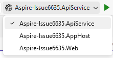
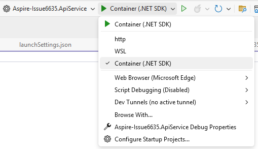
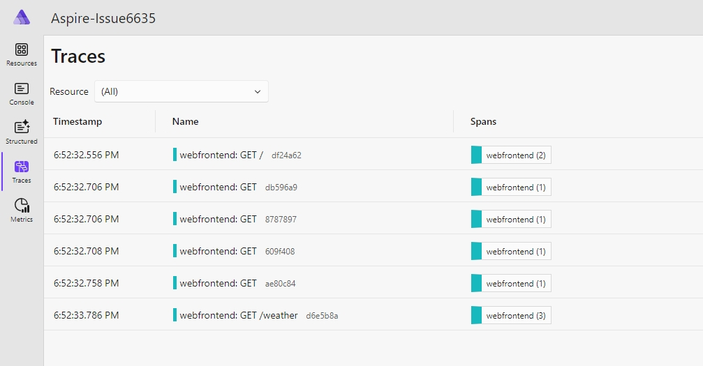
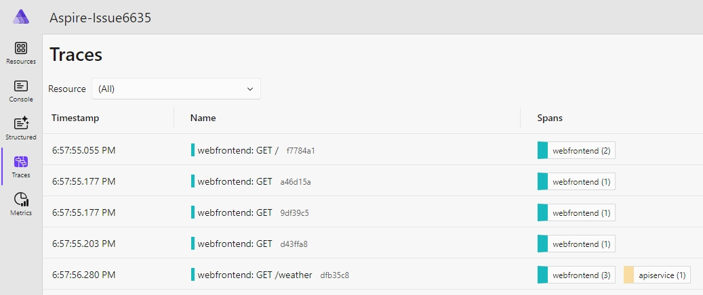

# Repro for issue <https://github.com/dotnet/aspire/issues/6635>

1. Select the **Aspire-Issue6635.ApiService** project as the startup project.

2. Select the **Container (.NET SDK)** profile.

3. Build the **Aspire-Issue6635.ApiService** project.
4. Select the **Aspire-Issue6635.AppHost** project as the startup project.
5. Start **podman**
6. Run.

Selecting **Wheather** in the **webfrontend** will show telemetry to the Aspire dashboard from the **webfrontend** only:

When using **docker** where the dashboard shows telemetry from the **apiservice**:

